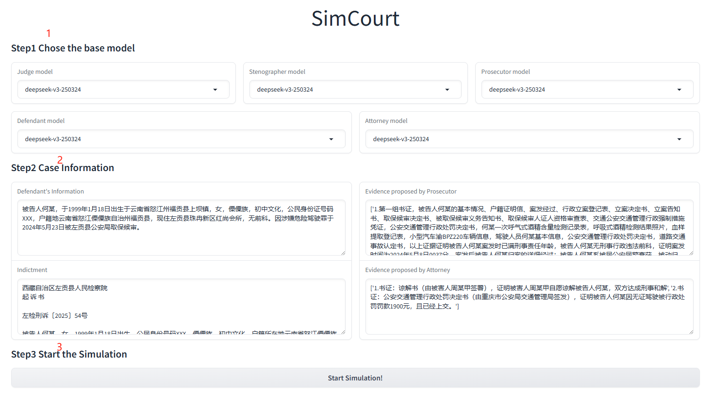
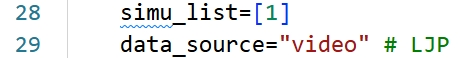
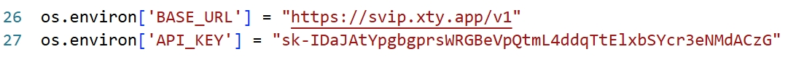

# SimCourt
We present the first court simulation framework -- SimCourt -- based on the real-world procedure structure of Chinese courts.

## A. Directory&Files introduction

Introductions:
```bash
.
├── agent_full.py # full version of agent design
├── agent.py # simplified version of agent design (w/o memory and strategy)
├── api_pool # the collection of llm api
├── data # dataset (benchmark)
│   ├── data_generation  # data collection and generation scripts  
│   ├── data_LJP # data used in LJP task
│   └── data_video # data used in process evaluation
├── experiments
│   ├── judgment_prediction 
│   │   ├── LJP_results # LJP results of all methods, including SimCourt and Ablation Study
│   │   └── other_methods # Implementation of baselines and ablation methods
│   └── process_evaluation
│       ├── annotator_1.xlsx # annotations by annotator 1
│       ├── annotator_2.xlsx # annotations by annotator 2
│       ├── annotator_3.xlsx # annotations by annotator 3
│       ├── HumanTrial # 20 trial records collected by human 
│       └── SimCourt result # 20 trial records simulated by SimCourt 
├── frontEnd.py # frontEnd design and UI design (with gradio)
├── gradio_demo # pictures in the demo
├── LLM # LLM client 
├── logs # running logs
├── main_full.py # full version of SimCourt
├── main.py # simplified version of SimCourt (w/o reflection)
├── multirun.py # directly run the simulation
├── resource # resources including legal articles
├── settings # tasks of each role (used when building profile module)
└── test_result # 
```

Note that, 'agent.py' and 'main.py' are both simplified version, with strategy module, memory module and reflection mechanism deleted. That's because making a full simulation need approximately 40 minutes and cost 0.5$, which is time consuming and money consuming, so we used the simplified version for presentation. If you want to apply full version, **just replace 'agent.py' with 'agent_full.py' and replace 'main.py' with 'main_full.py'** 


## B. Start the Simulation
To start the simulation, you have two choices: Start the simulation with UI or directly launch SimCourt through command line.

### I. Environment

The environment requirements are listed in 'requirement.txt'

```bash
conda create --name SimCourt python=3.9 -y
conda activate SimCourt
pip install -r requirements.txt
```
### II. Method1: Simulation with UI

In the terminal under the current directory, using command 

```bash
python main.py
```

Then open the gradio link in the terminal, then choose the model-type and the fill the simulation input, and click "Start Simulation".



### III. Method2: Direct Simulation

First, open the file '\multirun.py', then change the 'simu_list' in the 28 line (you can add multiple ids if you want). And you may change the 'data_source' if you want.




'data_source' can be chosen from 'video' or 'LJP'. When choosing 'video', it means simulating the data in 'data/data_video' while choosing 'LJP' means simulating the data in 'data/data_LJP'.

If you choose 'video' as the source, then the ids in 'simu_list' should be in the range of [1,20]. If you choose 'LJP' as the source, then the ids in 'simu_list' should be one of {0,1,2,3,4,10,11,12,13,14,...,390,391,392,393,394}

Then, in the terminal under the current directory, using command 

```bash
python multirun.py
```

to start the simulation. 

You are also recommended using 

```bash
python multirun.py > "logs/multirun_$(date '+%m%d_%H%M%S').log" 2>&1
```

to save the process and details of the simulation.

<!-- Note: the simulation may takes over 30~50 minutes, which depends on the complexity of the case and api. -->


## C.Note: 
1.We provided an api for llm calling in 
./api_pool/api_pool.py
. The quota is approximately 2.5\$. If the API quota is used up, please fill in your own API and the operator's URL. The cost is about 0.5\$ per trial. 

2.We will provide the calling function of LegalOne once the paper is accepted. So currently we commented the 'yilvkezhi' function in agent.py and do not use that tool in the demo.