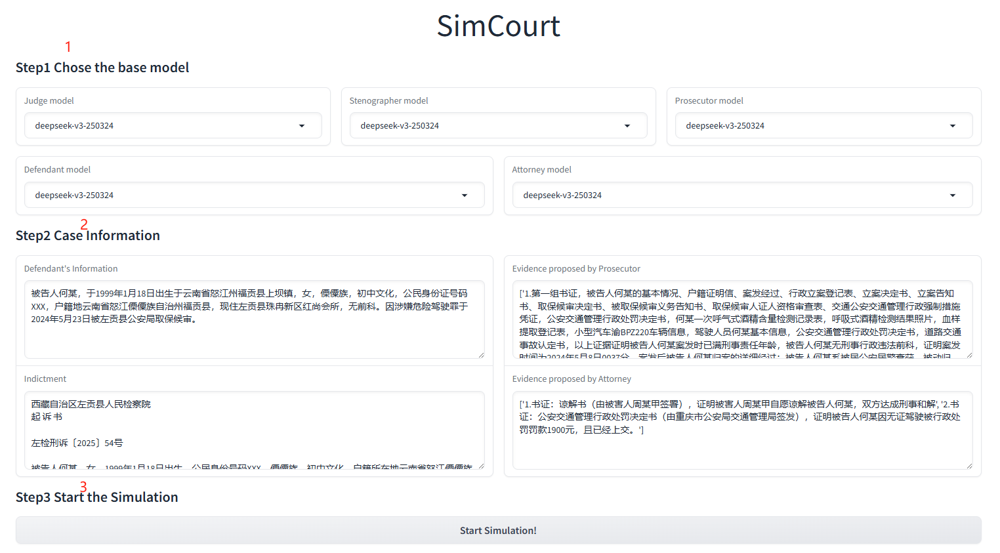
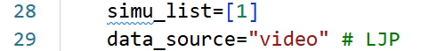
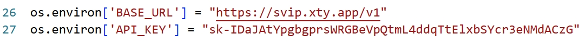

# SimCourt

<p align="center">
  <strong>Chinese Court Simulation with LLM-Based Agent System</strong>
</p>

<p align="center">
  <a href="#installation">Installation</a> ·
  <a href="#usage">Usage</a> ·
  <a href="#citation">Citation</a> ·
  <a href="#license">License</a>
</p>

<p align="center">
  
  
  
</p>

SimCourt is an LLM-based multi-agent system for simulating Chinese court proceedings. It coordinates role-playing agents—including the judge, clerk, prosecutor, defendant, and advocate—through multiple stages of a trial. The repository contains a Gradio demo, batch simulation scripts, model adapters, legal resources, and the data and experiment organization used in the accompanying research.

> **Research release:** SimCourt was accepted to **Findings of the Association for Computational Linguistics: ACL 2026**.
>
> **Important:** This project is a research prototype and is not a substitute for professional legal advice or a real judicial process. Model outputs may be incomplete, inaccurate, or inconsistent.

## Highlights

- **Multi-agent courtroom simulation** with separate legal roles and stage-specific prompts.
- **Interactive Gradio interface** for quickly trying a case simulation.
- **Batch execution** for running multiple cases and saving detailed logs.
- **Pluggable LLM backends** through the clients in [`LLM/`](LLM/), including API-based and offline interfaces.
- **Two execution modes:** a lightweight version for demonstrations and a full version with additional memory, strategy, and reflection mechanisms.

## Repository structure

```text
.
├── agent.py                 # Simplified agent implementation for the demo
├── agent_full.py            # Full agent implementation
├── main.py                 # Simplified Gradio simulation entry point
├── main_full.py             # Full simulation entry point
├── multirun.py              # Batch simulation runner
├── frontEnd.py              # Gradio interface and simulation orchestration
├── prompts.py               # Prompt utilities
├── LLM/                    # LLM client and backend implementations
├── api_pool/               # API helpers and local-model utilities
├── resource/               # Legal articles and other runtime resources
├── settings/               # Prompt, role, model, and task configuration
├── data/                   # Dataset and benchmark files
├── experiments/            # Evaluation scripts and experiment outputs
├── gradio_demo/            # Generated demo media and temporary outputs
├── logs/                   # Example and runtime logs
├── image*.png              # README/demo screenshots
├── SimCourt.pdf            # Project paper artifact
├── requirements.txt        # Python dependencies
└── LICENSE                 # MIT License
```

### Simplified and full implementations

`main.py` and `agent.py` provide the simplified path used for demonstrations. It is faster and less expensive to run. `main_full.py` and `agent_full.py` retain the full simulation design, including the additional strategy, memory, and reflection components, but can take substantially longer and use more API credits. Use the simplified path first when validating your environment.

## Installation

We recommend Python 3.9 or newer. A Conda environment can be created as follows:

```bash
conda create --name SimCourt python=3.9 -y
conda activate SimCourt
pip install -r requirements.txt
```

## Configuration

Before starting a simulation, configure an LLM provider and model that are available to you. The main configuration and role examples are under [`settings/`](settings/); provider adapters are under [`LLM/`](LLM/), and API helper code is under [`api_pool/`](api_pool/).

Keep credentials local and rotate any credentials that may have been exposed. Do **not** paste API keys, API secrets, or private endpoints into this README, commit them to Git, or share them in screenshots. Prefer environment variables or an ignored local configuration file when adapting the examples for your own deployment.

## Usage

### Interactive UI

Launch the simplified Gradio demo from the repository root:

```bash
python main.py
```

Open the Gradio URL printed in the terminal, choose the model configuration, enter the case information, and click **Start Simulation**.



### Batch simulation

For repeatable or multi-case runs, edit `multirun.py` and set `simu_list`, `data_source`, and the model name for your environment. The current script provides a small example configuration:

```python
simu_list = [1]
data_source = "video"  # or "LJP"
```

Then run:

```bash
python multirun.py
```

To preserve the detailed output in a timestamped log:

```bash
python multirun.py > "logs/multirun_$(date '+%m%d_%H%M%S').log" 2>&1
```

The original simulation conventions are:

- `video`: cases from the video-based data source; IDs are expected in the range `[1, 20]`.
- `LJP`: cases from the legal judgment prediction data source; use an ID supported by the files available under `data/`.

A simulation can take roughly **30–50 minutes**, depending on the case, model provider, and network conditions. API usage may incur provider charges; the historical estimate in this project was approximately **US$0.50 per trial**, but current costs depend on the selected model and prompt lengths.

### Full simulation

After confirming that the simplified demo works, use the full entry point when you need the complete agent design:

```bash
python main_full.py
```

The full version is intended for research experiments and may require additional configuration and significantly more time or API budget.

## Demo

The repository includes example outputs and screenshots:





For experiment artifacts, see [`data/`](data/), [`experiments/`](experiments/), and [`logs/`](logs/).

## Limitations and notes

- Results depend on the selected LLM, prompts, case representation, and API availability.
- The system is for research and demonstration; it should not be used to make legal, judicial, or other high-impact decisions.
- The LegalOne-related `yilvkezhi` integration remains commented out in the demo path and is not required to run the standard simulation.
- Please check the terms, privacy requirements, and usage limits of every model or data provider used with this repository.

## Citation

If you use this repository or dataset, please cite:

> Kaiyuan Zhang et al., *Chinese Court Simulation with LLM-Based Agent System*, Findings of the Association for Computational Linguistics: ACL 2026.

## License

The data in this repository is licensed under the MIT License. The software and accompanying materials are also distributed under the MIT License; see [`LICENSE`](LICENSE) for the complete text.

If you use this dataset, please cite: Kaiyuan Zhang et al., *Chinese Court Simulation with LLM-Based Agent System*, Findings of the Association for Computational Linguistics: ACL 2026.
